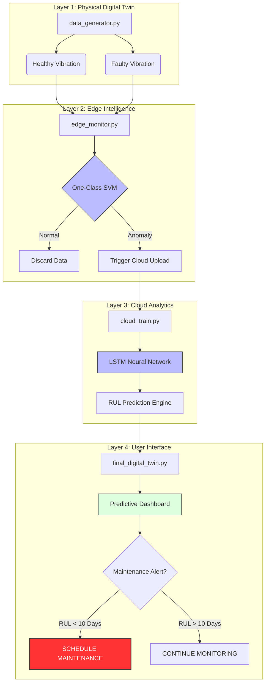

**Intelligent Digital Twin for Motor Health Forecasting**

**Overview**

This project implements an end-to-end Industrial IoT (IIoT) pipeline for predictive maintenance. It combines Edge Computing for real-time anomaly detection and Cloud Analytics for predicting the Remaining Useful Life (RUL) of industrial motors.

By leveraging a Digital Twin approach, I simulated mechanical degradation to train deep learning models, solving the common "data scarcity" problem in smart manufacturing.

**System Performance & Results**
1. Digital Twin Data Generation
We simulate both healthy and faulty motor states to provide the models with high-fidelity training data. This graph compares the stable rhythmic hum of a healthy motor against the chaotic spikes of a simulated bearing fault.

2. Motor Degradation Trends
To train the predictive model, I generated 50 days of degradation data. This "Death Curve" represents the exponential increase in vibration intensity as mechanical wear progresses.

3. Deep Learning: LSTM Model Training
The Long Short-Term Memory (LSTM) network was trained over 100 epochs. The loss curve shows rapid convergence, demonstrating that the model effectively learned the temporal relationship between vibration trends and motor longevity.

4. Predictive Maintenance Dashboard
The final output is a live dashboard where the AI forecasts the RUL. When the blue prediction line enters the red "Maintenance Threshold" (10 days remaining), the system triggers an automated alert to prevent downtime.

**Architecture**

1. Edge Layer (One-Class SVM): Local anomaly detection to filter noise and reduce cloud bandwidth costs by ~90%.

2. Cloud Layer (LSTM): Time-series forecasting to predict precisely when failure will occur.

3. Decision Logic: Automated maintenance scheduling based on predicted remaining life.

**Author**

Alireza Sorousheh Master’s Student in Connected Industry 4.0

Universidad Carlos III de Madrid (UC3M)