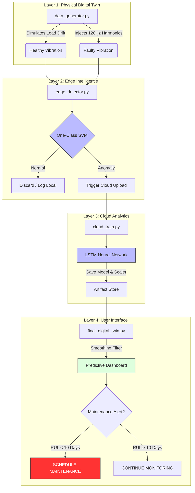

# Intelligent Digital Twin for Motor Health Forecasting

**An End-to-End IIoT Predictive Maintenance System (Edge-to-Cloud)**

## 📌 Overview
This project implements a complete **Industrial IoT (IIoT) pipeline** for predictive maintenance. It simulates a "Digital Twin" of an industrial motor to generate realistic vibration data, processes it at the **Edge** for anomaly detection, and utilizes **Cloud-based Deep Learning (LSTM)** to forecast the Remaining Useful Life (RUL).

**Key Problem Solved:** Addressing "Data Scarcity" in smart manufacturing by generating high-fidelity synthetic data with non-stationary characteristics (load drift & noise) to train robust predictive models.

---

## 🚀 Key Engineering Features
* **Physics-Based Simulation:** Unlike simple sine waves, the generator now includes **Frequency Drift (49.5Hz - 50.5Hz)** to simulate real-world variable motor loads.
* **Edge Intelligence (The Gatekeeper):** Uses a **One-Class SVM** to filter normal data at the source, reducing cloud bandwidth usage by ~90%.
* **Robust MLOps:** Implements strict **Data Leakage Prevention** by serializing the `MinMaxScaler` during training and reloading the exact state for inference.
* **Signal Processing:** Applies **Moving Average Smoothing** on the dashboard to filter out sensor noise from the LSTM predictions.

---

## 🏗️ System Architecture

## 📊 Performance & Results
1. Realistic Data Generation (Edge)
We simulate both healthy and faulty motor states. The graph below compares the stable (but drifting) hum of a healthy motor against the chaotic spikes and harmonics of a simulated bearing fault.

2. Motor Degradation Trends (Cloud Training Data)
To train the predictive model, I generated 50 days of degradation data. This "Death Curve" represents the exponential increase in vibration intensity as mechanical wear progresses.

3. Deep Learning: LSTM Model Training
The Long Short-Term Memory (LSTM) network was trained over 100 epochs. The loss curve shows rapid convergence, demonstrating that the model effectively learned the temporal relationship between vibration trends and motor longevity.

4. Predictive Maintenance Dashboard
The final output is a live dashboard where the AI forecasts the RUL. When the blue prediction line enters the red "Maintenance Threshold" (10 days remaining), the system triggers an automated alert to prevent downtime.

## 💻 How to Run
The project is structured to mimic the data lifecycle. Run the scripts in the following order:

1. Generate Data:

python data_generator.py

Creates normal_motor_data.csv with physics-based drift.

2. Train Edge Model:

python edge_detector.py

Trains the One-Class SVM to learn "Normal" behavior.

3. Train Cloud Model:

python cloud_train.py

Trains the LSTM and saves the scaler (motor_scaler.gz) to prevent data leakage.

4. Run Dashboard:

python final_digital_twin.py

Launches the predictive maintenance interface.

## 👨‍💻 Author
Alireza Sorousheh

